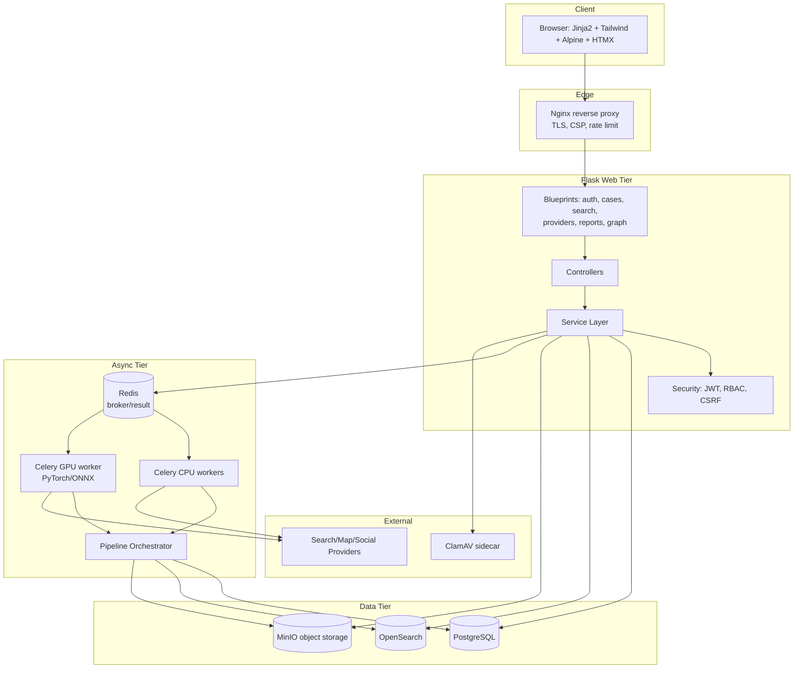
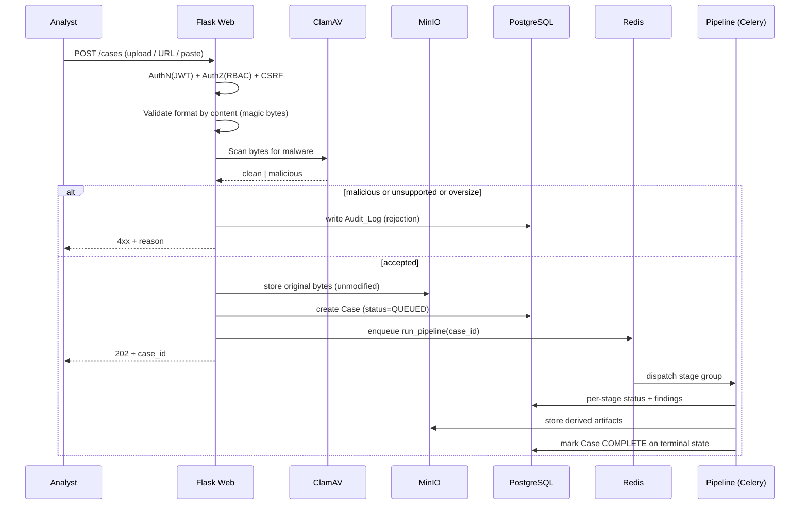
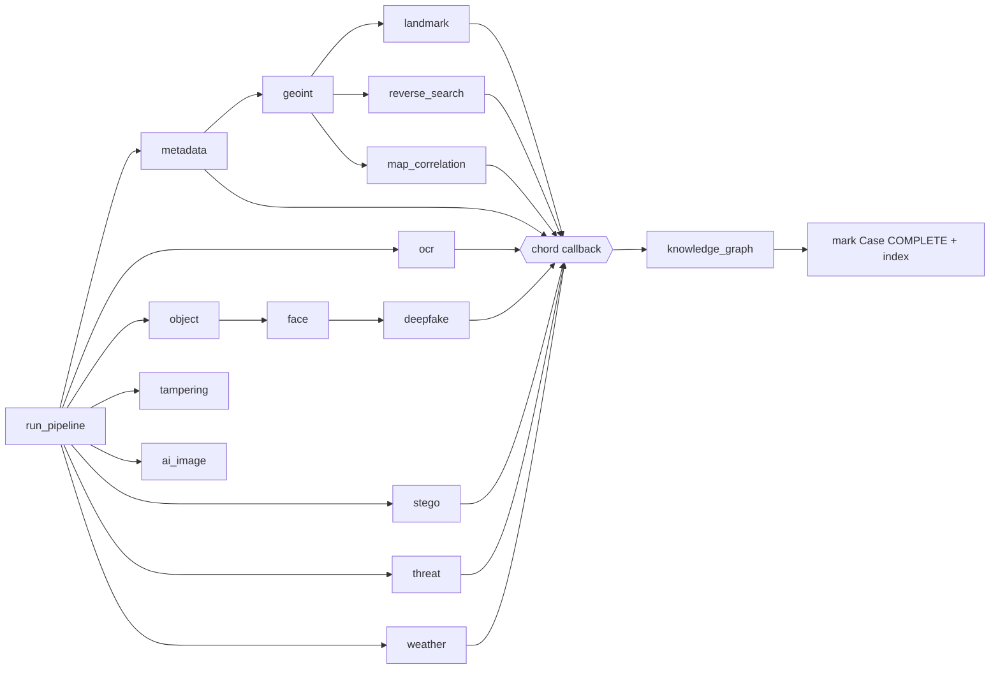
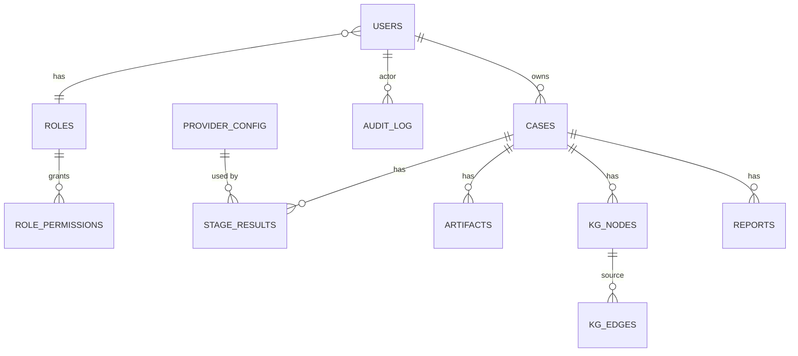
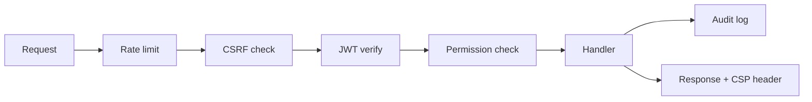
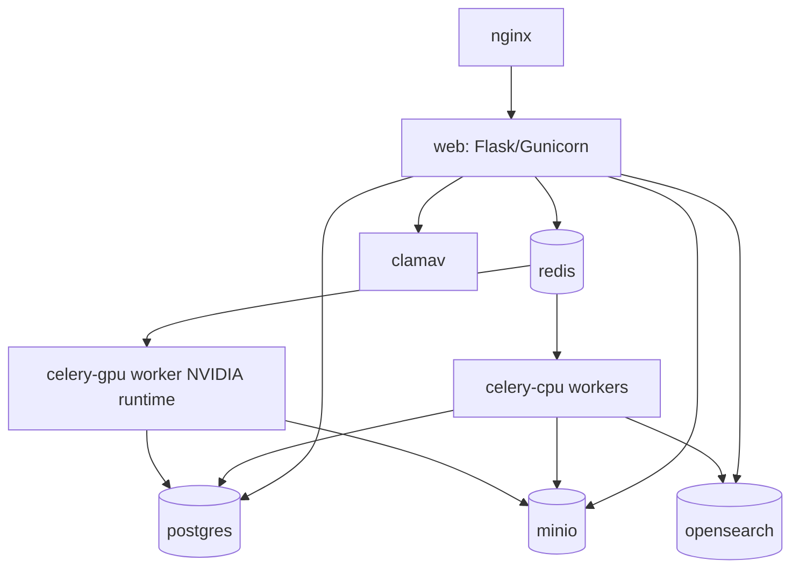

# Design Document: AURALIS VISION

## Overview

AURALIS VISION is an enterprise Image Intelligence Platform delivered as a Flask web
application backed by an asynchronous analysis pipeline. An Analyst submits an image, the
platform creates a persistent Case, and an orchestrated pipeline runs a sequence of
independent analysis stages (metadata forensics, GEOINT, landmark, OCR, reverse search,
object detection, face analysis, tampering, AI-image detection, deepfake, steganography,
threat intelligence, weather/shadow). Findings are persisted to PostgreSQL, indexed in
OpenSearch, linked into a Knowledge Graph, and compiled into an exportable report with a
final Confidence_Score.

The design optimizes for three properties that the requirements demand repeatedly:

1. **Failure isolation** — a single stage or external Provider failure must never abort the
   investigation (Requirements 6.4, 6.5, 16.2, 21.3, 26.3). Every cross-boundary call is
   wrapped so failures are recorded as findings rather than raised as fatal errors.
2. **Plug-and-play extensibility** — search/analysis Providers register against a uniform
   interface and become available without touching other Providers (Requirements 6.1, 6.7).
3. **Bounded, scored outputs** — most engines emit a Confidence_Score or Risk_Score in
   `[0, 100]` and several cap result counts (Requirements 4.2, 8.4, 10, 3.4, 9.4). These are
   pure scoring/ranking/normalization functions, which makes them ideal property-based-test
   targets.

### Technology Stack (fixed)

| Layer | Technology |
|-------|-----------|
| Web framework | Python Flask + Blueprints |
| ORM / migrations | SQLAlchemy + Alembic |
| Async tasks | Celery + Redis (broker & result backend) |
| Relational store | PostgreSQL |
| Object storage | MinIO (S3-compatible) |
| Search index | OpenSearch |
| AI/ML | PyTorch, HuggingFace Transformers, OpenCV, ONNX Runtime |
| Frontend | Jinja2, TailwindCSS, AlpineJS, HTMX |
| Edge / deploy | Nginx reverse proxy, Docker Compose, GPU worker support |

### Design Decisions Warranting Focused Review

- **DD-1 (pipeline fan-out):** stages run as a Celery group with a chord callback for
  terminal completion. Reviewers should confirm the chosen partial ordering (face before
  deepfake) is acceptable. See [Investigation Pipeline](#investigation-pipeline-orchestration).
- **DD-2 (face privacy):** face attributes are stored as non-reversible embeddings/cluster
  IDs only, never as identity-resolvable data (Requirement 11.4). Reviewers should validate
  this satisfies the privacy intent. See [Face Analysis Engine](#face-analysis-engine).
- **DD-3 (Provider trust boundary):** Providers call third-party services; all responses are
  treated as untrusted and normalized through a strict schema. See [Search Hub](#search-hub--provider-architecture).
- **DD-4 (malware scanning):** ClamAV runs as a sidecar service invoked synchronously before
  ingestion completes (Requirement 24.1), trading a small latency cost for a hard safety gate.

## Architecture

### Enterprise Architecture



The web tier is stateless and horizontally scalable behind Nginx. All long-running and
GPU-bound work is pushed to Celery workers so HTTP requests return quickly
(Requirement 21.2). PostgreSQL is the system of record; OpenSearch is a derived index that
can be rebuilt from PostgreSQL, which is why an indexing failure never loses data
(Requirement 26.3).

### Request and Processing Flow



### Async Pipeline Topology



Most stages are independent and run concurrently. A small number have data dependencies
(deepfake needs face output per Requirement 14.1/14.4; landmark/reverse/map build on
geo/metadata cues). Dependencies are expressed as Celery chains within the larger group; all
branches converge on a chord callback that builds the Knowledge Graph and marks the Case
complete (Requirement 21.5).

## Components and Interfaces

### Common Engine Contract

Every analysis engine implements a single interface so the orchestrator can treat them
uniformly. This is the backbone of failure isolation (Requirement 21.3).

```python
class StageResult:
    stage: str                 # canonical stage name
    status: str                # "completed" | "failed" | "not_applicable"
    findings: dict             # JSON-serializable, stage-specific payload
    artifacts: list[ArtifactRef]   # references to MinIO objects
    score: float | None        # Confidence_Score or Risk_Score in [0,100]
    error: str | None          # populated only when status == "failed"

class AnalysisEngine(Protocol):
    name: str
    def run(self, ctx: CaseContext) -> StageResult: ...
```

`CaseContext` carries the case id, a read-only handle to the original image bytes, prior
stage findings, and configuration (thresholds, limits). Engines never raise to the
orchestrator; they catch internal errors and return `status="failed"` with an `error`
message. The orchestrator persists whatever `StageResult` it receives.

### Ingestion Engine

Implements Requirements 1 and 24. Responsibilities:

- Accept images from file upload, drag-and-drop, pasted URL, screenshot, and camera capture.
  URL submissions are fetched server-side then validated (1.1, 1.8).
- Validate `Supported_Format` by inspecting magic bytes / decoding the image, never by file
  extension (1.2, 1.3, 24.3).
- Enforce max file size from config, returning the limit in the message (1.7).
- Run a malware scan (ClamAV) before any further processing; malicious files are rejected and
  the rejection is written to the Audit_Log (24.1, 24.2).
- Persist original bytes to MinIO unmodified and create a Case with a UUID identifier
  (1.4, 1.5, 24.4).
- For batch submissions, create one Case per image (1.6).

```python
class IngestionEngine:
    def ingest(self, source: ImageSource, user: User) -> IngestResult: ...
    # returns Accepted(case_id) | Rejected(reason, code)
```

Format detection table (content-sniffed): JPG/JPEG, PNG, WEBP, TIFF, BMP, HEIC.

### Metadata Engine

Implements Requirement 2. Extracts EXIF/XMP/ICC/thumbnail/orientation (2.1); records GPS,
camera/device/software, and timestamp fields when present (2.2–2.4); computes a metadata
Risk_Score (2.5); and emits structured anomaly flags:

- Missing expected fields → `missing_fields[]` (2.6).
- Camera-origin metadata present but GPS absent → `gps_removed` flag (2.7).
- Two recorded timestamps inconsistent → `timestamp_anomaly` flag (2.8).
- Editing software inconsistent with capture device → `metadata_manipulation` flag (2.9).

### GEOINT Engine

Implements Requirement 3. Runs scene/feature detection (buildings, roads, poles, mountains,
rivers, signs, architecture, vehicles, road markings) on the GPU worker (3.1), produces
candidate locations as `{country, state, city, confidence}` (3.2, 3.3), and returns them
ranked descending by Confidence_Score (3.4). If no cues are found it records
`location_inference=none` (3.5).

### Landmark Engine

Implements Requirement 4. Matches the image against a landmark embedding index, returns at
most the top 20 matches ranked by Confidence_Score (4.1, 4.2, 4.3). If nothing clears the
configured minimum confidence, records `landmark=none` (4.4).

### OCR Engine

Implements Requirement 5. Extracts text regions (5.1), detects language per region (5.2),
translates non-English regions to English (5.3), extracts named entities (business/street
names, vehicle registrations) (5.4), and derives location clues (5.5). Records
`text=none` when no text is found (5.6).

### Search Hub & Provider Architecture

Implements Requirement 6 and is the platform's extensibility core. The Search_Hub never
talks to a third party directly; it dispatches through registered Providers.

```python
class SearchCategory(Enum):
    GENERAL = "general"; IMAGE = "image"; MAP = "map"; SOCIAL = "social"

class NormalizedResult:        # the common result structure (6.3)
    title: str
    url: str | None
    snippet: str | None
    image_url: str | None
    published_date: datetime | None
    source: str                # provider name
    raw: dict                  # provider-specific extras
    score: float | None

class SearchProvider(Protocol):
    name: str
    category: SearchCategory
    timeout_seconds: float
    enabled: bool
    def query(self, request: SearchRequest) -> list[NormalizedResult]: ...

class ProviderRegistry:
    def register(self, provider: SearchProvider) -> None: ...      # 6.7
    def providers_for(self, category: SearchCategory) -> list[SearchProvider]: ...
    def set_enabled(self, name: str, enabled: bool) -> None: ...   # 6.6

class SearchHub:
    def search(self, category: SearchCategory, request: SearchRequest) -> SearchOutcome: ...
```

Dispatch semantics (`SearchHub.search`):

1. Resolve enabled Providers for the category from the registry (6.2, 6.6).
2. Fan out concurrently; each Provider call is bounded by `timeout_seconds` (6.4).
3. On timeout or error, record a `ProviderFailure{name, reason}` and **exclude** that
   Provider's output, continuing with the rest (6.4, 6.5).
4. Normalize successful results into `NormalizedResult` (6.3).
5. Return `SearchOutcome{results: list[NormalizedResult], failures: list[ProviderFailure]}`.

New Providers are added by implementing `SearchProvider` and calling `registry.register`;
no other Provider changes (6.7). Provider enable/disable state is persisted (see
`provider_config` table) and read on each dispatch (6.6).

### Reverse Search Engine

Implements Requirement 7. Submits the image to IMAGE-category Providers via the Search_Hub
(7.1), classifies each result as exact/near match (7.2), identifies the oldest appearance
from publication dates (7.3), records the websites the image appears on (7.4), and builds a
date-ordered source/discovery timeline (7.5). Records `matches=none` when empty (7.6).

### AI Search Agent

Implements Requirement 8. Given a Case, it analyzes the image plus existing findings (8.1),
generates derived search queries (8.2), executes them through the Search_Hub (8.3), ranks
results and returns at most the top 20 candidate locations (8.4), each with a Confidence_Score
(8.5). The agent is a planner over the Search_Hub, not a new Provider.

### Map Correlation Engine

Implements Requirement 9. For each candidate location it retrieves map/street-level imagery
from MAP Providers (9.1), compares road layouts, building shapes, and terrain (9.2), produces
a location Confidence_Score (9.3), and ranks candidates descending by that score (9.4).

### Object Detection Engine

Implements Requirement 10. Detects objects (faces, vehicles, logos, animals, aircraft, boats,
buildings) (10.1), recording class, bounding region, and Confidence_Score each (10.2),
producing an inventory (10.3). Records `objects=none` when nothing clears the minimum
confidence (10.4).

### Face Analysis Engine

Implements Requirement 11. Detects faces (11.1), records the count (11.2), clusters visually
similar faces across the Case (11.3), and records attributes as non-identity-resolvable
embeddings/cluster IDs only — never externally resolvable identity data (11.4, **DD-2**).
Records count zero when none detected (11.5).

### Tampering Engine

Implements Requirement 12. Analyzes for copy-move, cloning, object removal/insertion, and
splicing (12.1) using ELA, noise, JPEG quantization, compression, and PRNU analysis (12.2).
Produces a heatmap of affected regions when indicators are found and heatmap generation
succeeds (12.3), and always produces a tampering Confidence_Score (12.4). If heatmap
generation fails while indicators exist, records the detection plus `heatmap_produced=false`
(12.5).

### AI-Image Detection Engine

Implements Requirement 13. Analyzes for generation artifacts and generative-model metadata
signatures (13.1), produces an AI-generation probability as a Confidence_Score (13.2), records
the suspected generator family when signatures match (13.3), and flags the Case as likely
AI-generated when probability meets the configured threshold (13.4).

### Deepfake Engine

Implements Requirement 14. Runs only when the Case has at least one detected face (14.1);
otherwise records `not_applicable` (14.4). Produces an authenticity Confidence_Score (14.2)
and flags likely-deepfake when the score falls below the configured threshold (14.3).

### Steganography Engine

Implements Requirement 15. Scans for embedded archives/text/files/payloads (15.1), extracts
detected payloads as Case artifacts (15.2), produces a suspicion Risk_Score (15.3), and
records `hidden_data=none` when nothing is found (15.4).

### CTF Engine

Implements Requirement 16. On activation runs hidden-ZIP, QR, Base64, RGB channel split,
channel analysis, entropy analysis, file carving, and LSB analysis (16.1). Each technique is
isolated: a failing technique is recorded and the rest continue (16.2). Provides a hex view of
raw bytes on request (16.3), stores recovered data as artifacts (16.4), and emits a summary of
techniques run and outcomes (16.5).

### Threat Intelligence Engine

Implements Requirement 17. Evaluates for fake identity documents, fabricated screenshots, scam
imagery, and phishing assets (17.1), produces a threat Risk_Score (17.2), records each detected
indicator with its category (17.3), and flags a potential threat when the score meets the
configured threshold (17.4).

### Weather/Shadow Engine

Implements Requirement 18. Detects shadow direction/angle (18.1), estimates sun direction and
time of day when shadows exist (18.2), estimates weather conditions (18.3), and associates a
Confidence_Score with the estimated capture time (18.4). When no shadows/cues exist, records
that capture time could not be estimated and that estimation is not possible (18.5).

### Knowledge Graph

Implements Requirement 19. After stages complete, builds nodes for image, text, objects,
businesses, websites, search results, locations, map references, similar images, and social
profiles (19.1), and edges for their relationships (19.2). If node creation fails, the
investigation view renders without the graph plus an error message (19.3). Node selection
shows details and directly connected nodes (19.4); the graph is presented as an interactive
visualization in the investigation view (19.5).

### Report Generator

Implements Requirement 20. Compiles findings from completed stages (20.1) into a report with
an executive summary, per-stage findings, and a final Confidence_Score (20.2), in PDF, DOCX,
or JSON as requested (20.3). If requested for a Case with no completed stages, returns a
message that no findings are available and generates no report structure (20.4).

### Investigation Pipeline Orchestration

Implements Requirement 21. On Case creation it dispatches all thirteen stages asynchronously
as a Celery group with intra-group chains for dependencies (21.1, 21.2). Each stage:

- runs under the common engine contract; exceptions become `status="failed"` `StageResult`s
  so the pipeline records the failure and continues (21.3);
- on completion, atomically updates the Case with stage status and results (21.4).

A chord callback fires only after every branch reaches a terminal state
(`completed`/`failed`/`not_applicable`), builds the Knowledge Graph, and marks the Case
investigation complete (21.5). Stage status transitions: `pending → running → {completed |
failed | not_applicable}` (all three are terminal).

```python
class PipelineOrchestrator:
    def start(self, case_id: UUID) -> None: ...        # enqueue group + chord
    def on_stage_complete(self, case_id, result: StageResult) -> None: ...
    def finalize(self, case_id: UUID) -> None: ...     # KG build + mark complete + index
```

### Authentication / Authorization Services

Implements Requirement 23. `Authentication_Service` validates credentials and issues a signed
JWT (23.1), denying invalid credentials with a failure message (23.2). `Authorization_Service`
denies protected-resource access without a valid token (23.3) and permits an action only when
the Analyst's role grants the required permission (23.4), otherwise denies with an
authorization failure message (23.5). RBAC is permission-based with roles mapping to
permission sets.

## Data Models

### Relational Schema (PostgreSQL)



**users** — `id (UUID pk)`, `email (unique)`, `password_hash`, `role_id (fk)`, `created_at`,
`is_active`.

**roles** — `id`, `name (unique)`; **role_permissions** — `role_id (fk)`,
`permission (text)`. (Requirement 23.4)

**cases** — `id (UUID pk)`, `owner_id (fk users)`, `status (enum: queued, running,
complete)`, `original_object_key (MinIO)`, `original_filename`, `content_format`,
`final_confidence_score (float, nullable)`, `created_at`, `updated_at`. (Requirements 1.4,
21.5, 26.1)

**stage_results** — `id`, `case_id (fk)`, `stage (enum)`, `status (enum: pending, running,
completed, failed, not_applicable)`, `findings (jsonb)`, `score (float, nullable)`,
`error (text, nullable)`, `started_at`, `completed_at`. Unique `(case_id, stage)`.
(Requirements 21.3, 21.4)

**artifacts** — `id`, `case_id (fk)`, `stage`, `kind (enum: thumbnail, heatmap, extracted_payload,
carved_file, channel_image, report, etc.)`, `object_key (MinIO)`, `mime_type`, `size_bytes`,
`created_at`. (Requirements 15.2, 16.4, 12.3)

**kg_nodes** — `id`, `case_id (fk)`, `node_type (enum)`, `label`, `props (jsonb)`.
**kg_edges** — `id`, `case_id (fk)`, `src_node_id (fk)`, `dst_node_id (fk)`, `relation`,
`props (jsonb)`. (Requirements 19.1, 19.2)

**reports** — `id`, `case_id (fk)`, `format (enum: pdf, docx, json)`, `object_key`,
`final_confidence_score`, `created_at`. (Requirement 20)

**provider_config** — `id`, `name (unique)`, `category (enum)`, `enabled (bool)`,
`timeout_seconds (float)`, `settings (jsonb)`. (Requirements 6.6, 6.7)

**audit_log** — `id (bigserial)`, `actor_id (fk users, nullable)`, `action`,
`target_type`, `target_id`, `detail (jsonb)`, `created_at`. Append-only: no UPDATE/DELETE
grants; enforced by DB role privileges and an INSERT-only trigger guard. (Requirements 24.2,
25.6)

### Search Index (OpenSearch)

One `cases` index document per Case, denormalizing searchable findings: owner id, status,
extracted text, entities, locations (country/state/city), object classes, website domains,
landmark names, flags, and scores. Indexed after persistence; an index failure is recorded
and retried without affecting the persisted Case (26.2, 26.3). Search queries are filtered by
the requesting Analyst's authorization scope (26.4).

### JSON Finding Shapes

Per-stage `findings` JSON is versioned with a `schema_version` key. Representative example
(metadata):

```json
{
  "schema_version": 1,
  "gps": {"lat": 48.8584, "lon": 2.2945},
  "camera": {"make": "Apple", "model": "iPhone 14"},
  "timestamps": {"DateTimeOriginal": "2023-06-01T10:00:00Z"},
  "missing_fields": ["GPSAltitude"],
  "flags": {"gps_removed": false, "timestamp_anomaly": false, "metadata_manipulation": false},
  "risk_score": 22.5
}
```

## API Design (Flask Blueprints)

All routes are versioned under `/api/v1`. State-changing routes require a valid JWT, an RBAC
permission, and a CSRF token. Responses are JSON for the API; HTMX endpoints return HTML
fragments under `/ui`.

| Blueprint | Method & Route | Purpose | Requirements |
|-----------|----------------|---------|--------------|
| `auth` | `POST /api/v1/auth/login` | Authenticate, issue JWT | 23.1, 23.2 |
| `auth` | `POST /api/v1/auth/logout` | Invalidate session | 23.3 |
| `cases` | `POST /api/v1/cases` | Ingest single/batch image (upload, URL, paste) | 1.1–1.8, 24 |
| `cases` | `GET /api/v1/cases` | List Analyst's authorized cases | 26.4 |
| `cases` | `GET /api/v1/cases/{id}` | Restore case findings + artifacts | 26.5 |
| `cases` | `GET /api/v1/cases/{id}/status` | Per-stage status (polled by HTMX) | 21.4, 22.3 |
| `cases` | `POST /api/v1/cases/{id}/ctf` | Activate CTF Mode | 16.1 |
| `cases` | `GET /api/v1/cases/{id}/hexview` | Raw bytes in hex | 16.3 |
| `cases` | `POST /api/v1/cases/{id}/ai-agent` | Start AI Search Agent | 8.1 |
| `search` | `POST /api/v1/search` | Multi-provider search by category | 6.2 |
| `providers` | `GET /api/v1/providers` | List Providers + state | 6.6 |
| `providers` | `PATCH /api/v1/providers/{name}` | Enable/disable Provider | 6.6 |
| `graph` | `GET /api/v1/cases/{id}/graph` | Knowledge graph nodes/edges | 19.4, 19.5 |
| `reports` | `POST /api/v1/cases/{id}/report` | Generate report (pdf/docx/json) | 20.1–20.4 |
| `search-index` | `GET /api/v1/find?q=` | Query indexed findings (authz-filtered) | 26.4 |

Ingestion returns `202 Accepted` with the case id(s) and queues the pipeline. Rejections
return `400/413/415` with a human-readable reason that names supported formats or the size
limit (1.3, 1.7).

## Frontend Design

Server-rendered Jinja2 templates styled with TailwindCSS. AlpineJS handles local UI state
(tab switching, modals); HTMX handles partial updates and polling without a SPA framework.

- **Dashboard** (Requirement 22.1): persistent left sidebar with navigation to capability
  areas (Cases, Search Hub, Providers, Knowledge Graph, Reports, Admin/Audit). Main area
  lists recent cases with status badges.
- **Investigation view** (Requirement 22.2): tabbed sections, one per stage group (Metadata,
  GEOINT, Landmark, OCR, Reverse Search, Objects, Faces, Tampering, AI/Deepfake, Stego, CTF,
  Threat, Weather, Knowledge Graph, Report). Tabs are Alpine-controlled.
- **In-progress status** (Requirement 22.3): while the pipeline runs, each tab shows a stage
  status chip (pending/running/completed/failed/not_applicable). The page uses
  `hx-get /cases/{id}/status` on a polling trigger to refresh chips and swap in result
  fragments as stages finish (22.4).
- **Knowledge graph visualization** (Requirements 19.4, 19.5): an interactive graph
  (Cytoscape.js) embedded in its tab. Selecting a node calls `hx-get /cases/{id}/graph?node=`
  to show node details and directly connected nodes. If the graph payload reports a build
  failure, the tab renders an error message and the rest of the view stays usable (19.3).

## Security Architecture

Implements Requirements 23, 24, 25.

- **Authentication (JWT):** signed JWTs issued on login (23.1); invalid credentials denied
  with a failure message (23.2). Tokens carry subject and role; verified on every protected
  request (23.3).
- **Authorization (RBAC):** permission-based checks via a `@require_permission(perm)`
  decorator on routes/services. Missing permission → deny + authorization failure message
  (23.4, 23.5).
- **Secure upload & malware scanning:** content-type validated by magic bytes independent of
  extension (24.3); ClamAV scan before processing; malicious files rejected and logged to the
  Audit_Log (24.1, 24.2).
- **Isolated object storage:** originals and artifacts live in MinIO, separate from
  application execution paths; the web/worker processes hold scoped credentials and never
  execute stored bytes (24.4).
- **CSP headers:** Nginx and Flask emit a Content Security Policy on every response (25.1).
- **CSRF protection:** state-changing requests validate a CSRF token before processing
  (25.2).
- **Rate limiting:** per-client limits enforced at the edge (Nginx) and app (Flask-Limiter
  backed by Redis). Exceeding the limit rejects further requests until the window resets
  (25.3); a configured limit of zero rejects all rate-limited requests (25.4).
- **Secrets management:** secrets are read from environment/secret store (e.g., Docker
  secrets / Vault), never from source (25.5).
- **Audit logging:** every security-relevant action is appended to the append-only Audit_Log
  (25.6, 24.2).



## Folder Structure

```
auralis_vision/
├── docker-compose.yml
├── nginx/
│   └── nginx.conf
├── app/
│   ├── __init__.py            # app factory, blueprint registration
│   ├── config.py              # config loaded from env/secrets (25.5)
│   ├── api/                   # Flask blueprints (route definitions)
│   │   ├── auth.py
│   │   ├── cases.py
│   │   ├── search.py
│   │   ├── providers.py
│   │   ├── graph.py
│   │   ├── reports.py
│   │   └── ui.py              # HTMX fragment endpoints
│   ├── controllers/           # request orchestration, validation
│   ├── services/              # business logic (ingestion, pipeline, search hub)
│   │   ├── ingestion_service.py
│   │   ├── pipeline_orchestrator.py
│   │   ├── search_hub.py
│   │   ├── provider_registry.py
│   │   ├── report_service.py
│   │   └── knowledge_graph_service.py
│   ├── workers/               # Celery app, queues, GPU worker config
│   │   ├── celery_app.py
│   │   └── gpu_worker.py
│   ├── tasks/                 # Celery task wrappers per stage
│   ├── database/              # SQLAlchemy session, Alembic migrations
│   ├── models/                # ORM models (Case, StageResult, Artifact, ...)
│   ├── search_providers/      # pluggable providers (general/image/map/social)
│   │   ├── base.py            # SearchProvider protocol + NormalizedResult
│   │   └── builtin/
│   ├── geoint/                # GEOINT + landmark + map correlation engines
│   ├── ocr/                   # OCR engine + translation + NER
│   ├── forensics/             # metadata, tampering, weather/shadow engines
│   ├── deepfake/              # deepfake + face analysis engines
│   ├── ai_detection/          # AI-generated image detection engine
│   ├── reports/               # report renderers (pdf/docx/json)
│   ├── utils/                 # scoring, normalization, format detection, security helpers
│   ├── templates/             # Jinja2 (dashboard, investigation view, partials)
│   └── static/                # Tailwind build, Alpine, HTMX, Cytoscape assets
└── tests/
    ├── unit/
    ├── property/              # property-based tests (Hypothesis)
    └── integration/
```

The `ctf`, `stego`, `object`, `threat` engines live under `forensics/` and `geoint/` as
cohesive modules; engine modules are independently importable so a new engine or Provider can
be added without touching existing ones (Requirements 6.7, 21).

## Deployment Architecture

Docker Compose orchestrates the full stack; the GPU worker uses the NVIDIA container runtime.



| Service | Image / base | Role |
|---------|--------------|------|
| `nginx` | nginx | TLS termination, reverse proxy, CSP, edge rate limit |
| `web` | python + gunicorn | Flask app (stateless, scalable) |
| `celery-cpu` | python | CPU stages (metadata, OCR, stego, CTF, threat, reverse search) |
| `celery-gpu` | python + CUDA | GPU stages (GEOINT, landmark, object, face, tampering, AI-image, deepfake) |
| `redis` | redis | Celery broker/result backend + rate-limit store |
| `postgres` | postgres | System of record |
| `minio` | minio | Isolated object storage |
| `opensearch` | opensearch | Findings search index |
| `clamav` | clamav | Malware scanning sidecar |

Stages are routed to the CPU or GPU queue based on their compute profile; GPU workers can be
scaled or co-located independently (DD-1).

## Correctness Properties

*A property is a characteristic or behavior that should hold true across all valid executions
of a system — essentially, a formal statement about what the system should do. Properties
serve as the bridge between human-readable specifications and machine-verifiable correctness
guarantees.*

The acceptance criteria were analyzed and consolidated to remove redundancy: all bounded-score
criteria collapse into one parametric property, all cap+ranking criteria into one, and all
threshold-flag criteria into one. Each property below is universally quantified and intended
for property-based testing (Hypothesis), minimum 100 iterations.

### Property 1: Scores are bounded to [0, 100]

*For any* input to any scoring engine (metadata risk, GEOINT/landmark/map/AI-image/deepfake/
weather confidence, tampering confidence, stego/threat risk), the produced score is a number
in the inclusive range `[0, 100]`.

**Validates: Requirements 2.5, 3.3, 4.3, 8.5, 9.3, 12.4, 13.2, 14.2, 15.3, 17.2, 18.4**

### Property 2: Ranked candidate lists are capped and sorted descending

*For any* set of scored candidates, a ranking function returns a list that (a) contains only
elements from the input, (b) is sorted in non-increasing order of score, and (c) has length no
greater than the configured cap (20 for landmark and AI-agent candidates).

**Validates: Requirements 3.4, 4.2, 8.4, 9.4**

### Property 3: Threshold flags follow the comparison rule

*For any* score and configured threshold, a "≥-threshold" engine (AI-image, threat) flags the
Case iff `score >= threshold`, and a "<-threshold" engine (deepfake) flags the Case iff
`score < threshold`.

**Validates: Requirements 13.4, 14.3, 17.4**

### Property 4: Format validation is content-based and extension-independent

*For any* byte stream and any claimed file extension, ingestion accepts the submission iff the
content decodes to a Supported_Format, independent of the extension; rejections for
unsupported content return a message identifying the supported formats.

**Validates: Requirements 1.2, 1.3, 24.3**

### Property 5: File-size acceptance respects the configured maximum

*For any* file size, ingestion accepts iff `size <= configured_max`; an oversize rejection
returns a message stating the maximum allowed size.

**Validates: Requirements 1.7**

### Property 6: Original bytes are stored unmodified (round-trip)

*For any* accepted image, the bytes retrieved from object storage equal the submitted bytes
exactly.

**Validates: Requirements 1.5**

### Property 7: Each accepted image yields exactly one Case with a unique id

*For any* batch of N accepted images, exactly N Cases are created and all Case identifiers are
distinct.

**Validates: Requirements 1.4, 1.6**

### Property 8: Metadata recording preserves present fields and flags absences

*For any* set of metadata fields embedded in an image, the engine records exactly the present
fields and lists exactly the absent expected fields as missing.

**Validates: Requirements 2.1, 2.2, 2.3, 2.4, 2.6**

### Property 9: Metadata anomaly flags follow their rules

*For any* metadata input: `gps_removed` is true iff camera-origin metadata is present and GPS
is absent; `timestamp_anomaly` is true iff two recorded timestamps are inconsistent;
`metadata_manipulation` is true iff editing software is inconsistent with the capture device.

**Validates: Requirements 2.7, 2.8, 2.9**

### Property 10: Search Hub dispatches to exactly the enabled providers of a category

*For any* registry state and search category, the Search_Hub dispatches the request to exactly
the providers that are both registered for that category and enabled; disabled providers are
never dispatched.

**Validates: Requirements 6.2, 6.6**

### Property 11: Provider results normalize to the common structure

*For any* collection of raw provider payloads, every successfully processed result conforms to
the `NormalizedResult` schema with all required fields populated.

**Validates: Requirements 6.3**

### Property 12: Provider failures are isolated and recorded

*For any* set of providers where an arbitrary subset times out or returns errors, the
Search_Hub returns normalized results from exactly the non-failing providers, records each
failing provider in the failures list, and never raises.

**Validates: Requirements 6.4, 6.5**

### Property 13: Reverse-search match classification follows the similarity threshold

*For any* reverse-search result with a similarity value, the result is classified as an exact
match iff its similarity is at or above the configured threshold, otherwise a near match.

**Validates: Requirements 7.2**

### Property 14: Reverse-search correlation selects the oldest date, the website set, and an ordered timeline

*For any* set of reverse-search results with publication dates, the identified oldest
appearance equals the minimum date present, the recorded websites equal the distinct domains
of the results, and the timeline is ordered by date.

**Validates: Requirements 7.3, 7.4, 7.5**

### Property 15: Object detections carry valid structure

*For any* detector output, every reported detection in the inventory has a class label, a
bounding region within image bounds, and a score in `[0, 100]`, and the inventory contains
exactly the detections meeting the configured minimum confidence.

**Validates: Requirements 10.2, 10.3**

### Property 16: Face count matches detections and clustering is a valid partition

*For any* set of detected faces, the recorded count equals the number of detected faces, every
face is assigned to exactly one cluster, and faces with identical embeddings share a cluster.

**Validates: Requirements 11.2, 11.3, 11.5**

### Property 17: Stored face attributes contain no identity-resolvable data

*For any* detected face, the stored attribute record's fields are a subset of the allowed
non-identity attribute set (no externally resolvable identity data).

**Validates: Requirements 11.4**

### Property 18: Stego extraction round-trips embedded payloads

*For any* payload embedded into an image via a supported method, the Stego_Engine extracts a
Case artifact whose bytes equal the embedded payload.

**Validates: Requirements 15.2**

### Property 19: CTF mode isolates technique failures and reports every technique

*For any* arbitrary subset of CTF techniques that fail, all remaining techniques still execute
and the completion summary lists every technique exactly once with its outcome.

**Validates: Requirements 16.2, 16.5**

### Property 20: Hex view round-trips the raw bytes

*For any* image, decoding the hex-view output reproduces the original image bytes exactly.

**Validates: Requirements 16.3**

### Property 21: Threat indicators carry a valid category

*For any* set of detected threat indicators, each recorded indicator is annotated with a
category drawn from the allowed category set.

**Validates: Requirements 17.3**

### Property 22: OCR translation presence rule

*For any* extracted text region whose detected language is not English, the output includes an
English translation field; English regions are not required to carry one.

**Validates: Requirements 5.3**

### Property 23: Knowledge graph covers findings and contains no dangling edges

*For any* set of completed findings, the graph contains a node for every present entity, and
every edge connects two nodes that exist in the graph.

**Validates: Requirements 19.1, 19.2**

### Property 24: Node neighborhood query returns exact adjacency

*For any* graph and any selected node, the returned connected set equals exactly the nodes
sharing an edge with the selected node.

**Validates: Requirements 19.4**

### Property 25: Reports compile exactly the completed stages with required structure

*For any* Case, a generated report includes findings from exactly the completed stages
(excluding non-completed), and contains an executive summary, per-stage findings, and a final
Confidence_Score in `[0, 100]`.

**Validates: Requirements 20.1, 20.2**

### Property 26: JSON report round-trips

*For any* compiled report rendered as JSON, parsing the JSON reproduces the report's findings
structure.

**Validates: Requirements 20.3**

### Property 27: Pipeline schedules exactly the thirteen stages

*For any* created Case, the orchestrator schedules exactly the metadata, GEOINT, landmark, OCR,
reverse search, object, face, tampering, AI-detection, deepfake, steganography, threat, and
weather stages.

**Validates: Requirements 21.1**

### Property 28: Pipeline isolates stage failures and tracks status

*For any* arbitrary subset of stages that fail, every non-failing stage still executes, each
stage's recorded status and results reflect its outcome, and the pipeline does not abort.

**Validates: Requirements 21.3, 21.4**

### Property 29: Case completes iff all stages are terminal

*For any* combination of stage states, the Case investigation is marked complete iff every
stage is in a terminal state (completed, failed, or not_applicable), and never before.

**Validates: Requirements 21.5**

### Property 30: Protected resources require a valid token

*For any* protected route, a request lacking a valid session token is denied.

**Validates: Requirements 23.3**

### Property 31: Authorization permits an action iff the role grants the permission

*For any* role and requested action, the action is permitted iff the role's permission set
contains the required permission; otherwise it is denied with an authorization failure message.

**Validates: Requirements 23.4, 23.5**

### Property 32: Malicious files are rejected and audited; security actions are logged

*For any* upload scan verdict, a malicious verdict causes rejection and appends an audit entry,
and a clean verdict proceeds; more generally, every security-relevant action appends exactly
one entry to the append-only Audit_Log.

**Validates: Requirements 24.2, 25.6**

### Property 33: Every response carries a CSP header

*For any* route response, a Content Security Policy header is present.

**Validates: Requirements 25.1**

### Property 34: State-changing requests require a valid CSRF token

*For any* state-changing request, the request is processed only when a valid CSRF token is
present; otherwise it is rejected before processing.

**Validates: Requirements 25.2**

### Property 35: Rate limiting admits up to the limit then rejects until reset

*For any* configured limit N and burst of requests within a window, the first N rate-limited
requests are admitted and all subsequent ones are rejected until the window resets (when
`N = 0`, all rate-limited requests are rejected).

**Validates: Requirements 25.3, 25.4**

### Property 36: Indexing failure retains the persisted Case

*For any* index operation that fails after persistence, the Case remains retrievable from the
relational store and the indexing failure is recorded.

**Validates: Requirements 26.3**

### Property 37: Indexed search returns only authorized Cases

*For any* search query and Analyst, every returned Case is within the Analyst's authorization
scope.

**Validates: Requirements 26.4**

### Property 38: Persistence round-trip restores findings and artifacts

*For any* Case, persisting then reloading reproduces equivalent findings and artifact
references.

**Validates: Requirements 26.1, 26.5**

## Error Handling

The platform's error strategy is layered to satisfy the pervasive failure-isolation
requirements.

- **Ingestion (synchronous, fail-closed):** unsupported format, oversize, malicious, or
  unreadable submissions are rejected with a clear HTTP error and reason; rejections that are
  security-relevant are written to the Audit_Log (1.3, 1.7, 24.2). No Case is created on
  rejection.
- **Provider calls (isolated, fail-open):** every Provider invocation is wrapped with a
  timeout and try/except. Failures become `ProviderFailure` records; the Search_Hub continues
  with the remaining Providers and never propagates the failure (6.4, 6.5).
- **Analysis stages (isolated, fail-open):** the common engine contract guarantees engines
  return `StageResult(status="failed", error=...)` instead of raising. The orchestrator
  records the failed stage and proceeds; a failed stage is a terminal state (21.3, 21.5).
- **CTF techniques (isolated):** each technique runs in its own guarded call; a failure is
  recorded in the summary and the remaining techniques continue (16.2, 16.5).
- **Artifact sub-failures:** when a stage partially succeeds (e.g., tampering detected but
  heatmap generation fails), the stage records the primary finding plus a flag noting the
  missing artifact rather than failing the whole stage (12.5).
- **Knowledge graph build:** if node creation fails, the investigation view renders without
  the graph and shows an error, leaving all other tabs usable (19.3).
- **Indexing (decoupled from persistence):** OpenSearch indexing happens after the PostgreSQL
  commit. An indexing failure is caught, recorded, and retried out-of-band; the persisted Case
  is never rolled back (26.3).
- **Auth/Authz:** invalid credentials, missing tokens, and insufficient permissions return
  explicit failure messages with appropriate 401/403 codes (23.2, 23.3, 23.5).
- **Reporting on empty Cases:** a report request for a Case with no completed stages returns an
  informational message and produces no report structure (20.4).

All caught exceptions are logged with the case id and stage for traceability; security-relevant
errors additionally append to the Audit_Log.

## Testing Strategy

The platform uses a dual approach: property-based tests for universal logic properties and
example/integration tests for ML model behavior, wiring, UI, and infrastructure. ML inference
and external Providers are mocked in property tests so the pure logic (scoring, ranking,
normalization, orchestration, validation) is tested in isolation and cheaply at 100+
iterations.

### Property-Based Testing

- **Library:** Hypothesis (Python). Properties are not implemented from scratch.
- **Iterations:** each property test runs a minimum of 100 generated examples.
- **Coverage:** each of Properties 1–38 above is implemented by a single property-based test
  in `tests/property/`.
- **Tagging:** each test is tagged with a comment in the format
  `# Feature: auralis-vision, Property {number}: {property_text}`.
- **Generators:** custom Hypothesis strategies produce scored-candidate lists, metadata field
  sets, provider payloads/verdicts, stage-state combinations, role/permission/action triples,
  byte streams with valid/invalid image headers, embeddable payloads, and graph
  node/edge sets. ML engines are represented by their structured output schemas so logic
  properties (bounds, ordering, isolation, round-trips) are exercised without GPU inference.

### Unit and Example Tests (`tests/unit/`)

Cover criteria classified as EXAMPLE/EDGE_CASE: input-method acceptance (1.1, 1.8),
ML-model-driven detection sanity (3.1, 4.1, 5.1–5.5, 10.1, 11.1, 13.1, 17.1, 18.1–18.3),
empty/edge cases (3.5, 4.4, 5.6, 7.6, 10.4, 11.5, 14.4, 15.4, 18.5, 20.4),
heatmap-failure branch (12.5), provider-interface conformance (6.1, 6.7), and auth flows
(23.1, 23.2).

### Integration Tests (`tests/integration/`)

Cover cross-service behavior with real or containerized dependencies: end-to-end ingestion →
pipeline → report, ClamAV scanning (24.1), MinIO storage isolation (24.4), OpenSearch
indexing and authorized search (26.2, 26.4), Celery async dispatch (21.2), and the full
investigation view rendering with HTMX status polling (22.1–22.4).

### Smoke Tests

One-time configuration checks: object-storage isolation (24.4) and secrets-from-store with no
secrets in source (25.5).

### Why PBT applies here

The platform is rich in pure, input-varying logic — scoring functions, ranking/cap functions,
result normalization, validation rules, threshold flags, round-trip serialization/extraction,
and orchestration state machines — exactly the class of code where "for all inputs X,
property P(X) holds" statements are meaningful and where 100+ randomized iterations expose
edge cases (boundary scores, empty collections, duplicate embeddings, partial failures). ML
inference quality, UI layout, and infrastructure wiring are intentionally excluded from PBT
and covered by example, integration, and smoke tests instead.
