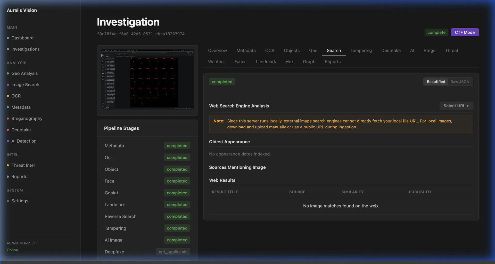

# Auralis Vision — Enterprise Image Forensics & Intelligence Platform

Auralis Vision is an industry-grade, professional image forensics and open-source intelligence (OSINT) platform. It provides automated extraction of metadata, OCR text, landmarks, object inventories, face clusters, steganography payloads, and image manipulation metrics, bringing them together into an interactive Cytoscape knowledge graph and downloadable executive reports.



---

## Key Forensics Modules

Auralis Vision runs **13 automated analysis stages** in a dependency-aware order, ensuring deep inspection and high-fidelity intelligence collection:

1. **Metadata Analysis**: Extracts camera model, device software, creation timestamps, and orientation tags. Flags manipulation, software-to-camera mismatches, and stripped GPS fields.
2. **OCR Intelligence**: Isolates text regions, detects language, translates non-English text, and automatically indexes business names, street addresses, and vehicle registration numbers.
3. **Object Detection**: Inventories salient objects and regions using Haar cascades, Canny contours, or optional YOLOv8 ONNX models.
4. **Faces & Clusters**: Detects human faces and groups them into visual identity clusters using HSV color histogram correlation.
5. **Geo-Intelligence (GEOINT)**: Resolves coordinates, translates OCR place names, and uses a green/blue/gray color ratio terrain classifier to suggest country/city candidates.
6. **Landmark Recognition**: Performs line segment density and verticality checks to characterize structural features (man-made vs. natural).
7. **Reverse Image Search**: Dispatches live searches to Google Lens, Lenso.ai, Bing Visual Search, Yandex, TinEye, SauceNAO, IQDB, Karma Decay, and Pinterest via temporary public uploads.
8. **Tampering & ELA**: Computes Error-Level Analysis (ELA) heatmaps, Laplacian local noise variance, double-JPEG quantization mismatches, and PRNU noise maps.
9. **AI Image Detection**: Analyzes high-frequency diffusion artifacts in the FFT domain and parses camera/generative model signatures to detect AI-generated media.
10. **Steganography (Stego)**: Scans trailing image bytes for embedded ZIP/RAR/7z archives, checks byte entropy, and extracts hidden printable strings.
11. **Threat Intelligence**: Correlates OCR keywords with scam, phishing, or identity fraud signatures to flag high-risk cases.
12. **Weather & Environment**: Estimates brightness levels, captures weather conditions (clear, overcast), and derives shadow directions/strengths.
13. **Knowledge Graph & Reports**: Connects all findings into a Cytoscape interactive graph and compiles them into downloadable PDF, DOCX, or JSON reports.

---

## Tech Stack & Architecture

* **Backend**: Python / Flask, SQLite (Development) / PostgreSQL (Production)
* **Async Workers**: Celery (Redis broker) for fanning out heavy analysis tasks across CPU and GPU queues
* **Forensics Engines**: OpenCV, Pillow (PIL), NumPy, PyTesseract, LangDetect
* **Frontend**: HTML5, Vanilla CSS (Notion Dark Mode theme), Alpine.js, HTMX (polling/live state updates), Cytoscape.js

---

## Setup & Running Locally

### 1. Prerequisites
Ensure you have Python (>= 3.10) and PyTesseract/Tesseract installed on your system.

### 2. Installation
Clone the repository and set up a virtual environment:
```bash
git clone https://github.com/Saketkesar/auralis.git
cd auralis
python3 -m venv .venv
source .venv/bin/activate
pip install -r requirements.txt
```

### 3. Running the Server
Run the Flask application in development mode:
```bash
APP_ENV=development SQLALCHEMY_DATABASE_URI=sqlite:///auralis_dev.db flask --app app:create_app run --port 5001 --debug
```
Access the interface at `http://127.0.0.1:5001/`.

### 4. Running the Tests
To validate code correctness, run the test suite:
```bash
pytest
```
